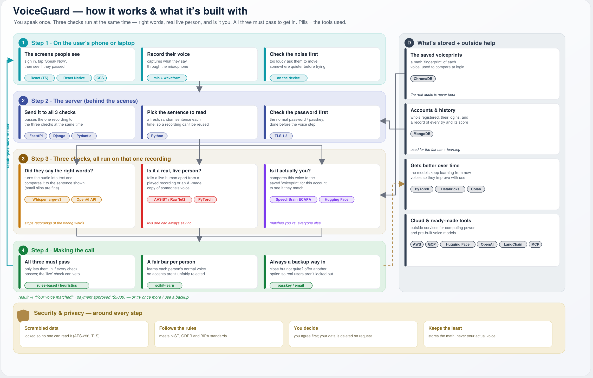

# VoiceGuard

Voice-biometric multi-factor authentication with anti-spoofing and deepfake detection.

## Problem statement

Passwords and one-time codes are weak or alarming: codes can be phished or
SIM-swapped, and passwords get reused and leaked. Voice is convenient, but a
plain voiceprint can be beaten by a recording or an AI-generated deepfake.
VoiceGuard verifies a person for app login and for approving sensitive
transactions by checking three things at once on a single short recording:
what they said (the prompted words), who they are (their voiceprint), and
that the voice is live and real (not a replay or a synthetic clone).

## What it does

On enrollment, a user records a few short spoken samples and we build an
encrypted voiceprint (a numeric summary of their voice, not the raw audio).
On each login or transaction approval, the app shows a short passage to read
aloud. We then run three checks on that one recording:

1. Content check: did they read the prompted words? (defeats replay of an old clip)
2. Identity check: does the voiceprint match the enrolled user?
3. Liveness check: is the audio a live human, not a recording or deepfake?

All three must pass, and the liveness check can veto on its own. Only then is
the login or transaction approved.

## MVP scope (what we will build)

- Enroll a voice profile (record samples, build and store an encrypted voiceprint)
- Log in by reading a prompted passage aloud
- The three-check verification pipeline (content, identity, liveness)
- A clear pass / fail result screen with a retry path
- Basic account and session handling

## Out of scope (not in the MVP)

- Authenticating live phone callers into a call center
- Native mobile app (web first; React Native comes later)
- Support for many languages beyond the initial set
- On-device (offline) verification

## Success criteria

- A user can enroll a voice profile end to end.
- A user can log in by reading a prompted passage, and the three checks run.
- A known replay clip is rejected by the content or liveness check.
- The frontend and backend are both deployed and reachable at public URLs.
- The team can run the whole thing locally from the instructions in this repo.

## Tech stack

| Layer      | Choice                                             |
|------------|----------------------------------------------------|
| Frontend   | React + TypeScript (built with Vite)               |
| Backend    | FastAPI (Python), run with uvicorn                 |
| Records DB | MongoDB Atlas                                       |
| Voiceprints| ChromaDB (vector store, added later)               |
| Models     | Whisper (content), SpeechBrain ECAPA (identity), AASIST/RawNet2 (liveness) |
| Hosting    | Vercel (frontend), Render (backend)                |
| CI/CD      | GitHub Actions                                      |

## Architecture

See the diagram at `docs/architecture.png`.

## External services and accounts

- MongoDB Atlas (database)
- Hugging Face (pretrained models, later)
- OpenAI API (optional, hosted Whisper, later)
- Vercel (frontend hosting)
- Render (backend hosting)

## Top risks and mitigations

1. Liveness / deepfake detection may not generalize to new attack types.
   Mitigation: start with a published anti-spoofing model, keep a held-out
   test set of attacks, and treat liveness as a veto so a weak pass never
   approves on its own.
2. Voice data is sensitive. Mitigation: store only encrypted voiceprints,
   never raw audio, and keep secrets out of the repo via environment variables.
3. Three-month timeline is tight for five people. Mitigation: ship the
   skeleton in Sprint 0, then build one user story per feature branch behind
   passing CI.

## Local setup

- Backend: see `backend/README.md`.
- Frontend: from `frontend/`, run `npm install` then `npm run dev`.

## Live URLs

- Frontend: https://voiceguard-nu.vercel.app/
- Backend: [add Render URL here]

## Team and mentors

- Team: Sumehra, Nicole, Tulika, Gabriel
- Technical mentors: [names]
